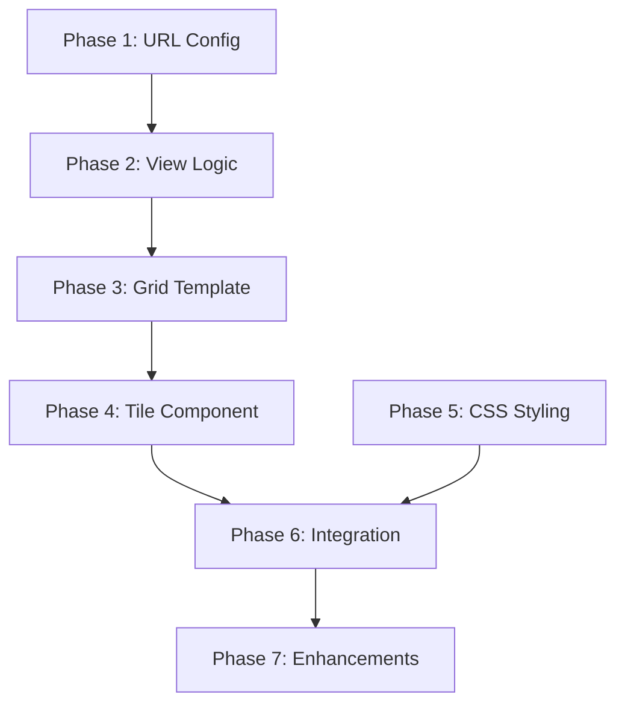

# Tasks: Album Grid Main Page (User Story 1)

**Feature**: Album Catalog Visualization - Main Album Grid Page
**Input**: User request: "Main page of the application show the albums in a grid, latest first. There's the album cover and under is the artist, album, vocal style and genre"
**User Story**: US1 - Browse Album Catalog (Priority P1)
**Prerequisites**: Models, migrations, and data import already complete
**Branch**: `001-album-catalog`

## Summary

Implement the main album catalog page showing albums in a responsive grid layout. Each tile displays the album cover, artist name, album name, vocal style, and genre. Albums are sorted by release date (newest first).

## Format: `- [ ] [ID] [P?] [US1] Description with file path`

- **Checkbox**: `- [ ]` for incomplete tasks
- **[P]**: Task can run in parallel (different files, no dependencies)
- **[US1]**: All tasks belong to User Story 1
- Include exact file paths in descriptions

## Path Conventions

- Views: `catalog/views.py`
- URLs: `catalog/urls.py`, `config/urls.py`
- Templates: `catalog/templates/catalog/`
- Static files: `catalog/static/catalog/`
- Tests: `tests/`

---

## Phase 1: URL Configuration and Base Template

**Purpose**: Set up URL routing and base template structure

- [ ] T001 [US1] Add catalog app URLs to config/urls.py (mount at root or /catalog/)
- [ ] T002 [P] [US1] Create catalog/urls.py with album list URL pattern
- [ ] T003 [P] [US1] Create base template catalog/templates/catalog/base.html with Tailwind CSS and HTMX
- [ ] T004 [P] [US1] Verify static files configuration in config/settings.py

---

## Phase 2: Album List View

**Purpose**: Create Django view for album list with queryset

- [ ] T005 [US1] Create AlbumListView in catalog/views.py (ListView or function-based)
- [ ] T006 [US1] Configure queryset to order albums by release_date DESC, then imported_at DESC
- [ ] T007 [US1] Add select_related for artist, genre, vocal_style (optimize queries)
- [ ] T008 [P] [US1] Add context processor or view context for page title

---

## Phase 3: Album Grid Template

**Purpose**: Create HTML template with grid layout

- [ ] T009 [US1] Create catalog/templates/catalog/album_list.html extending base.html
- [ ] T010 [US1] Add responsive grid container (#album-tiles) using CSS Grid or Tailwind
- [ ] T011 [US1] Create album tile loop rendering all albums from queryset
- [ ] T012 [P] [US1] Add empty state message when no albums exist

---

## Phase 4: Album Tile Component

**Purpose**: Create reusable album tile displaying all required information

- [ ] T013 [US1] Create catalog/templates/catalog/components/album_tile.html
- [ ] T014 [US1] Add album cover image with get_cover_art_or_placeholder() method
- [ ] T015 [US1] Add artist name display
- [ ] T016 [US1] Add album name display
- [ ] T017 [US1] Add vocal style display
- [ ] T018 [US1] Add genre display
- [ ] T019 [P] [US1] Add release date display using formatted_release_date()
- [ ] T020 [P] [US1] Add country display (if available)

---

## Phase 5: CSS Styling

**Purpose**: Style the grid and tiles for responsive layout

- [ ] T021 [P] [US1] Update catalog/static/catalog/css/album-catalog.css with grid styles
- [ ] T022 [P] [US1] Add responsive breakpoints (mobile: 1 col, tablet: 2 cols, desktop: 3-4 cols)
- [ ] T023 [P] [US1] Style album tiles (card layout, hover effects, shadows)
- [ ] T024 [P] [US1] Style album cover images (aspect ratio, object-fit)
- [ ] T025 [P] [US1] Style text elements (artist, album, genre, vocal style)

---

## Phase 6: Template Integration and Testing

**Purpose**: Wire everything together and verify functionality

- [ ] T026 [US1] Include album_tile.html component in album_list.html
- [ ] T027 [US1] Test page loads at configured URL
- [ ] T028 [US1] Verify albums display in grid layout
- [ ] T029 [US1] Verify albums sorted newest first
- [ ] T030 [US1] Verify all tile information displays correctly
- [ ] T031 [US1] Test responsive layout on different screen sizes
- [ ] T032 [US1] Test with no albums (empty state)
- [ ] T033 [US1] Test with many albums (scrolling behavior)

---

## Phase 7: Optional Enhancements

**Purpose**: Polish and improve user experience

- [ ] T034 [P] [US1] Add loading indicator for album grid
- [ ] T035 [P] [US1] Add CSS transitions for tile hover effects
- [ ] T036 [P] [US1] Add lazy loading for album cover images
- [ ] T037 [P] [US1] Add link to Spotify from album tiles (optional)

---

## Task Count Summary

- **Total Tasks**: 37
- **Phase 1 (URLs & Base)**: 4 tasks
- **Phase 2 (View Logic)**: 4 tasks
- **Phase 3 (Grid Template)**: 4 tasks
- **Phase 4 (Tile Component)**: 8 tasks
- **Phase 5 (CSS Styling)**: 5 tasks
- **Phase 6 (Integration & Testing)**: 8 tasks
- **Phase 7 (Enhancements)**: 4 tasks (optional)
- **Parallelizable Tasks**: 18 tasks marked [P]

## Dependencies



**Phases 4 and 5 can be worked on in parallel after Phase 3 completes.**

---

## Implementation Strategy

### MVP Scope
Complete Phases 1-6 (T001-T033) for full User Story 1 functionality. This provides:
- Working album grid page
- All required information displayed
- Responsive layout
- Proper sorting (newest first)

### Incremental Delivery
1. **Phase 1-2**: URL routing and view (enables page access)
2. **Phase 3-4**: Template structure and tile component (displays albums)
3. **Phase 5**: CSS styling (makes it look good)
4. **Phase 6**: Testing and verification (ensures quality)
5. **Phase 7**: Optional enhancements (polish)

### Parallel Execution Opportunities

**Phase 1** (after T002 complete):
```bash
# These can run simultaneously
- T003: Create base template
- T004: Verify static files config
```

**Phase 4** (after T013-T018 complete):
```bash
# These can run simultaneously
- T019: Add release date display
- T020: Add country display
```

**Phase 5** (entire phase can run in parallel with Phase 4):
```bash
# All CSS tasks can run simultaneously
- T021: Grid styles
- T022: Responsive breakpoints
- T023: Tile styles
- T024: Image styles
- T025: Text styles
```

**Phase 7** (all optional enhancements can run in parallel):
```bash
# These can run simultaneously
- T034: Loading indicator
- T035: Hover transitions
- T036: Lazy loading
- T037: Spotify links
```

---

## Independent Test Criteria

After completing Phases 1-6, verify:

1. **Page Access**: Navigate to `/` or `/catalog/` shows album grid
2. **Grid Layout**: Albums display in responsive grid (1-4 columns based on screen size)
3. **Album Information**: Each tile shows:
   - Album cover image (or placeholder)
   - Artist name
   - Album name
   - Vocal style
   - Genre
   - (Optional) Release date and country
4. **Sorting**: Albums appear newest first (check release dates)
5. **Empty State**: Page shows helpful message when no albums exist
6. **Responsive**: Test on mobile (375px), tablet (768px), desktop (1920px)
7. **Data Integrity**: All albums from database appear on page

---

## Acceptance Criteria (from User Story 1)

✅ **AC1**: User opens application → sees grid of album tiles with covers
✅ **AC2**: User views tile → sees artist, album, release date, genre, country, vocal style
✅ **AC3**: User scrolls → grid adjusts responsively to screen size
✅ **AC4**: User views catalog → albums sorted newest first

---

## Technical Notes

- **Queryset Optimization**: Use `select_related('artist', 'genre', 'vocal_style')` to avoid N+1 queries
- **Image Handling**: Use `get_cover_art_or_placeholder()` method from Album model
- **Date Formatting**: Use `formatted_release_date()` method from Album model
- **CSS Framework**: Tailwind CSS v4 (via CDN) + custom CSS in album-catalog.css
- **Grid System**: CSS Grid or Tailwind grid classes for responsive layout
- **No JavaScript**: HTMX will be added in later user stories (filtering)

---

## Example Implementation Hints

### Grid CSS (catalog/static/catalog/css/album-catalog.css)
```css
#album-tiles {
    display: grid;
    gap: 1.5rem;
    padding: 1rem;
}

@media (min-width: 768px) {
    #album-tiles { grid-template-columns: repeat(2, 1fr); }
}

@media (min-width: 1024px) {
    #album-tiles { grid-template-columns: repeat(3, 1fr); }
}

@media (min-width: 1536px) {
    #album-tiles { grid-template-columns: repeat(4, 1fr); }
}
```

### View (catalog/views.py)
```python
from django.views.generic import ListView
from catalog.models import Album

class AlbumListView(ListView):
    model = Album
    template_name = 'catalog/album_list.html'
    context_object_name = 'albums'

    def get_queryset(self):
        return Album.objects.select_related(
            'artist', 'genre', 'vocal_style'
        ).order_by('-release_date', '-imported_at')
```

### Template Structure
```
base.html (Tailwind CSS, HTMX script, common header/footer)
  └── album_list.html (grid container, page title)
        └── album_tile.html (individual tile component)
```

---

## Notes

- This tasks file focuses solely on User Story 1 (main grid page)
- User Story 2 (detail view), 3 (genre filter), and 4 (vocal filter) are separate features
- No HTMX functionality in this phase - just static grid rendering
- All models, migrations, and data import are already complete
- CSS file already created but needs grid-specific styles
- Placeholder image already exists at catalog/static/catalog/images/placeholder-album.svg
