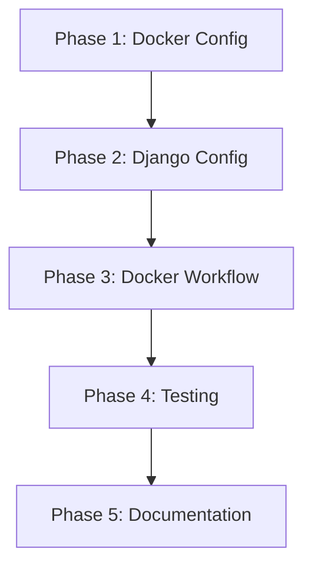

# Tasks: Add PostgreSQL with Docker

**Feature**: Album Catalog Visualization - PostgreSQL Database Setup
**Input**: User request: "Add PostgreSQL as the database. Use docker to run it and use docker-compose to initialize it."
**Prerequisites**: Existing Django project with SQLite
**Branch**: `001-album-catalog`

## Summary

Add PostgreSQL database support using Docker and docker-compose for local development. This enhances the development environment to match production requirements while maintaining SQLite for testing.

## Format: `- [ ] [ID] [P?] Description with file path`

- **Checkbox**: `- [ ]` for incomplete tasks
- **[P]**: Task can run in parallel (different files, no dependencies)
- Include exact file paths in descriptions

## Path Conventions

- Docker files: Project root
- Django settings: `config/settings.py`
- Environment files: `.env`, `.env.example`
- Documentation: `README.md`

---

## Phase 1: Docker Configuration Files

**Purpose**: Create Docker and docker-compose configuration for PostgreSQL

- [X] T001 Create Dockerfile for Django application in project root
- [X] T002 Create docker-compose.yml in project root with PostgreSQL service configuration
- [X] T003 Create .dockerignore file in project root to exclude unnecessary files
- [X] T004 [P] Create docker/postgres/init.sql for database initialization scripts (optional)
- [X] T005 [P] Create docker/postgres/postgresql.conf for PostgreSQL configuration tuning (optional)

---

## Phase 2: Django Database Configuration

**Purpose**: Configure Django to use PostgreSQL with environment-based settings

- [X] T006 Update config/settings.py to support both SQLite (default) and PostgreSQL (via DATABASE_URL)
- [X] T007 Add dj-database-url dependency to pyproject.toml for DATABASE_URL parsing
- [X] T008 Run uv sync to install dj-database-url
- [X] T009 Update .env.example with PostgreSQL connection string example
- [X] T010 Update .env with local PostgreSQL connection string (DATABASE_URL)

---

## Phase 3: Docker Development Workflow

**Purpose**: Establish commands and documentation for Docker-based development

- [X] T011 Create Makefile with common Docker commands (up, down, migrate, shell, logs)
- [X] T012 Update README.md with Docker setup instructions
- [X] T013 Update README.md with PostgreSQL connection details
- [X] T014 [P] Create scripts/docker-entrypoint.sh for application startup with migrations
- [ ] T015 Test docker-compose up -d starts PostgreSQL successfully
- [ ] T016 Test Django connects to PostgreSQL via docker-compose
- [ ] T017 Test migrations run successfully in Docker environment
- [ ] T018 Test data import command works with PostgreSQL

---

## Phase 4: Testing Configuration

**Purpose**: Ensure tests use SQLite while development uses PostgreSQL

- [X] T019 Update config/settings.py to use SQLite for tests (override DATABASE in test settings)
- [X] T020 Create pytest.ini or update pyproject.toml with test database configuration
- [X] T021 Run pytest to verify tests still pass with PostgreSQL configured
- [X] T022 [P] Add test for database connection in tests/test_database_config.py

---

## Phase 5: Documentation and Cleanup

**Purpose**: Complete documentation and verify setup

- [X] T023 [P] Add docker-compose.yml documentation comments
- [X] T024 [P] Create DOCKER.md with detailed Docker workflow documentation
- [X] T025 Update CLAUDE.md with Docker and PostgreSQL setup information
- [ ] T026 Test full workflow: docker-compose up → migrate → import_albums → verify data
- [X] T027 Create .env.docker example for production-like Docker configuration

---

## Task Count Summary

- **Total Tasks**: 27
- **Phase 1 (Docker Config)**: 5 tasks
- **Phase 2 (Django Config)**: 5 tasks
- **Phase 3 (Docker Workflow)**: 8 tasks
- **Phase 4 (Testing)**: 4 tasks
- **Phase 5 (Documentation)**: 5 tasks
- **Parallelizable Tasks**: 7 tasks marked [P]

## Dependencies



**All phases must complete sequentially. Within each phase, tasks marked [P] can run in parallel.**

---

## Implementation Strategy

### MVP Scope
Complete Phases 1-3 for basic Docker + PostgreSQL functionality. This provides:
- Docker-based PostgreSQL for development
- Django configured to use PostgreSQL
- Basic documentation for Docker workflow

### Incremental Delivery
1. **Phase 1-2**: Core Docker and database configuration (blocks all other work)
2. **Phase 3**: Docker development workflow (enables team to use Docker)
3. **Phase 4**: Testing configuration (ensures tests remain fast)
4. **Phase 5**: Documentation and polish (improves onboarding)

### Parallel Execution Opportunities

**Phase 1** (after T003 complete):
```bash
# These can run simultaneously
- T004: Create init.sql
- T005: Create postgresql.conf
```

**Phase 3** (after T013 complete):
```bash
# These can run simultaneously
- T014: Create docker-entrypoint.sh
- Tests T015-T018 can be planned in parallel
```

**Phase 4** (after T020 complete):
```bash
# These can run simultaneously
- T022: Add database connection test
```

**Phase 5** (all tasks can run in parallel):
```bash
# These can run simultaneously
- T023: Add docker-compose comments
- T024: Create DOCKER.md
- T025: Update CLAUDE.md
```

---

## Independent Test Criteria

After completing all phases, verify:

1. **Docker Startup**: `docker-compose up -d` starts PostgreSQL successfully
2. **Database Connection**: Django can connect to PostgreSQL
3. **Migrations**: `docker-compose exec web python manage.py migrate` succeeds
4. **Data Import**: `docker-compose exec web python manage.py import_albums --limit 10` succeeds
5. **Data Verification**: Albums appear in PostgreSQL database
6. **Test Suite**: `pytest` still passes (using SQLite for tests)
7. **Documentation**: README accurately describes Docker setup process

---

## Notes

- SQLite remains the default for tests (faster, isolated)
- PostgreSQL used for local development and production
- Docker Compose manages PostgreSQL lifecycle
- Environment variables control database selection
- All existing functionality must continue working
